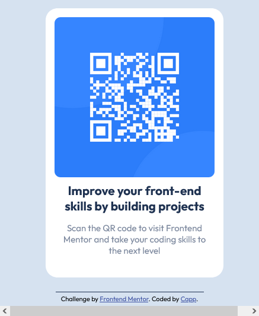

# Frontend Mentor - QR code component solution

This is a solution to the [QR code component challenge on Frontend Mentor](https://www.frontendmentor.io/challenges/qr-code-component-iux_sIO_H). Frontend Mentor challenges help you improve your coding skills by building realistic projects. 

## Table of contents

- [Overview](#overview)
  - [Screenshot](#screenshot)
  - [Links](#links)
  - [Built with](#built-with)

## Overview

### Screenshot

Desktop final layout result

Mobile final layout result

### Links

- Live Site URL: [qrcode-component-challenge](https://qrcode-component-eight.vercel.app)

# Built with

- Semantic HTML5 markup
- CSS custom properties